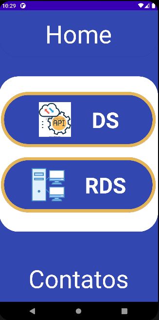
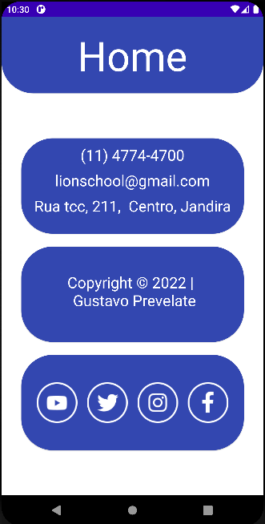
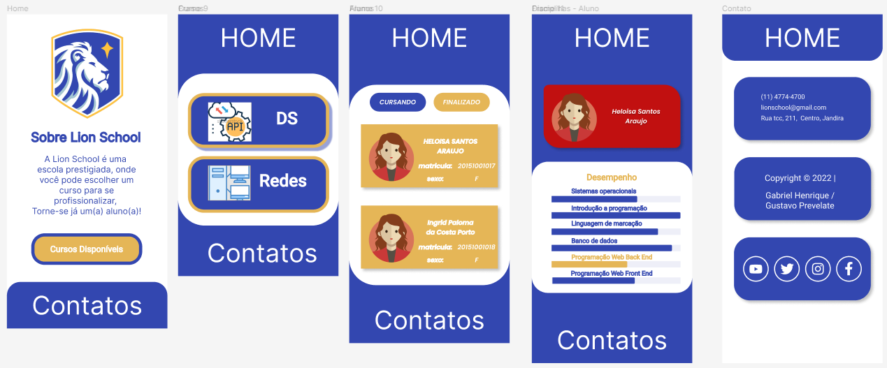

# DS2M - A - Gustavo Prevelate Ribeiro Da Silva

---

# Portfólio
---

---

### Sobre esse site:

Site desenvolvido para colocar os conhecimentos obtidos no curso do [SENAI Jandira](https://jandira.sp.senai.br/) em prática, com criação de um mobile aplication, utilizando a API LionSchool.

---
## Tecnologias

- KOTLIN
- RETROFIT DEPENDENCIES
- COIL DEPENDENCE
- JETPACK COMPOSE

---
## Itens Adicionais

- Figma

[Clique aqui](https://www.figma.com/file/nL7HHsfZpJpswZUSr1OXWM/KotlinLionSchool---Apresentar?type=design&node-id=0-1&t=Acc9p9oLqVmrvk42-0) para visitar o Figma.

---
## Equipe
- [Gustavo Prevelate Ribeiro Da Silva](https://github.com/GustavoPrevelate)

---
